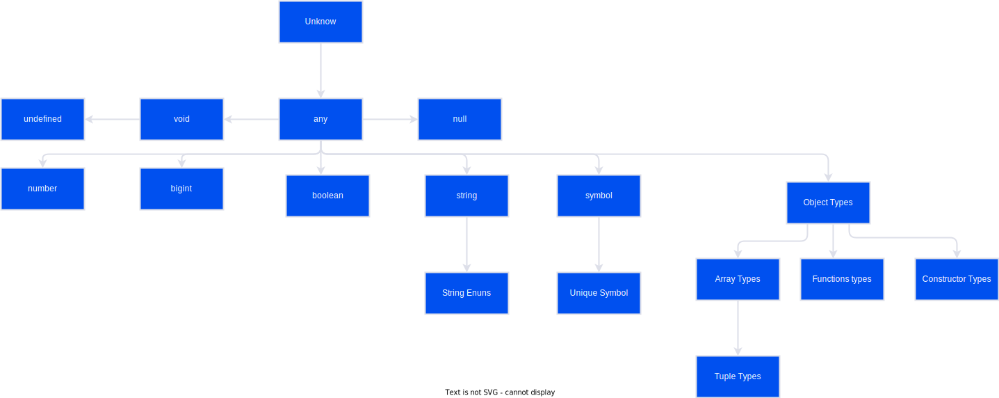

## Programming TypeScript

<details>
  <summary>TypeScript: A 10_000 Foot View (Chap 02)</summary>

## O compilador

1. Programa analisado em AST(n abstract syntax tree);
2. AST é compilado para um bytecode;
3. Bytecode é avaliado em tempo de execução.

> O TypeScript em vez de compilar diretamente para bytecode, o Type-Script compila para… código JavaScript! (Transpile)

> Mas antes disso, existe progragrama especial que (typechecker) que verifica se seu código é typesafe.

1. TypeScript source -> TypeScript AST [TSC]
   - Aqui é usado os tipos declarados;
2. AST é verificada por typechecker [TSC]
   - Aqui é usado os tipos declarados;
3. TypeScript AST -> JavaScript source [TSC]
   - Aqui não é mais utilizado os tipos.
   ```
   Quando o TSC compila seu código de TypeScript para JS, ele não olha mais para os seus tipos.
   ```
4. JavaScript source -> JavaScript AST [JS]
5. AST -> bytecode [JS]
6. ByteCode é avaliado em tempo de execução[JS]

JavaScript engine (V8, Spidermonkey[Firefox], JSCore[Safari], Chakra[Edge])

## O sistema de tipos

> Um conjunto de regras que um verificador de tipos usa para atribuir tipos ao seu programa.

- Dinâmico
- Estático (TS is incrementally compiled statically typed language)

> O TypeScript é inspirado em ambos os tipos de sistemas de tipos: você pode anotar explicitamente seus tipos ou pode
> deixar o TypeScript inferir a maioria deles para você.

> Em geral, é uma boa ideia deixar o TypeScript inferir tantos tipos quanto possível para você, mantendo o código
> digitado explicitamente no mínimo.

Comparação entre os sistemas de tipos enter Js e TS, para ajudar criar uma modelo mental de como o TS funciona:

| Recursos do sistemas de tipos             | JS                     | TS                        |
| ----------------------------------------- | ---------------------- | ------------------------- |
| Como os tipos são vinculados ?            | Dinâmico               | Estático                  |
| Os tipos são convertidos automaticamente? | Sim                    | Não(principal)            |
| Quando os tipos são verificados?          | Tempo de execução      | Tempo de compilação       |
| Quando os erros são encontrados ?         | Em execução(a maioria) | Em compilação (a maioria) |

> Se você precisar converter tipos, faça-o explicitamente.

> O compilador TSC é escrito em TypeScript, ou seja, o TS é uma linguagem
>
> bootstrapping [self-hosting](https://robertheaton.com/2017/10/24/what-is-a-self-hosting-compiler/#:~:text=A%20self-hosting%20compiler%20is%20one%20that%20can%20compile,writing%20%3D%2C%20you%20write%20the%20actual%20word%20EQUALS.)

## [TSLint](https://palantir.github.io/tslint/)

- `npx tslint --init` - Para habilitar o tslint estilização de código

## Dicas

1. Instale o `ts-node` e use-o para compilar e executar seu TypeScript com um único comando.
2. Use uma ferramenta de scaffolding como `typescript-node-starter` para gerar rapidamente sua estrutura de pastas para
   você.

</details>

<details>
  <summary>Tudo sobre os (Chap 03)</summary>
  
  > Um conjunto de valores e o que você pode fazer com eles.

> Quando você vê que algo é do tipo T, você não apenas sabe que é um T, mas também sabe exatamente o que pode fazer com esse T (e o que não pode).

### Hierarquia de tipos



## ABCs dos tipos

- `any`
  - Evite, assim como o fogo! (Utilizar noImplicitAny).
- `unknown`

  - Pode ser utilizado para valores desconhecidos, mas procure sempre conhecer seus valores!;
  - Também pode ser refinado.
  - Operadores que podem ser usados:

    > ==, ===, ||, &&, ?, !

  - Exemplo:

    ```typescript
    let a: unknown = 20; // TypesScript não inferirá nada sobre unknown;
    let b = a === 1234; // SIM! Podemos comparar os valores do tipo unknown, ou seja, utilizar os operadores relacionais.
    let c = a + 10; //  NÃO! Pois estamos pressupondo que ele é um número
    ```

- `boolean`
  Exemplo:
  ```Typescript
  let a = true // OK! boolean
  var b = false // OK! boolean
  const c = true // OK, PORÉM CONSTANTE. true
  let d: boolean = true // OK, Qualquer valor do conjunto boolean
  let e: true = true // type literals feature (um tipo que representa um único valor e nada mais)
  let f: true = false // ERROR, tipo literal apenas com valor true.
  ```
- `number`
  - Operações básicas aritméticas, relacionais ...
  - Curiosidade! (Podemos utilizar numeric separators, separadores numéricos)
  ```typescript
  let oneMillion = 1_000_000; // Igual à 1000000
  let a: 1_000_000_000_000_000 = 1000000000000000; // Muito útil para números grandes
  let b: 100000 = 100_000;
  console.log(a + b);
  ```
- `bigint`
  - Operações com inteiros
  ```typescript
  let a: bigint = 10n;
  ```
- `string`
- `symbol  (ES2015).`

  - Alternativa para chave de strings em objetos e maps
  - Um Symbol é único
  - O principal objetivo dos Symbols no TypeScript (e JavaScript) é fornecer uma maneira de criar identificadores únicos
  - Symbols permitem que você crie propriedades de objeto que são únicas e não podem ser sobrescritas ou acessadas acidentalmente1. Isso é útil quando você está escrevendo uma biblioteca ou um framework e quer evitar conflitos com o código do usuário.

  ```typescript
  let a = Symbol('a');
  let b: symbol = Symbol('B');
  ```

  ```typescript
  // Exemplo de key usando Symbolo
  const sym = Symbol('teste');
  let obj = {
  	[sym]: 'value',
  };
  console.log(obj[sym]); // "value"
  ```

  ```typescript
  const e = Symbol('e'); // typeof e
  const f: unique symbol = Symbol('f'); // typeof f
  ```

  > Pense em símbolos únicos como outros tipos literais, como 1, verdadeiro ou “literal”. Eles são uma forma de criar um tipo que representa um determinado habitante do símbolo.

- `object`

  - No exemplo abaixo ambos satisfazem o shape(interface)

    ```typescript
    // Definindo uma interface para objetos
    interface Aluno {
    	nome: string;
    	dataNascimento: string;
    }

    // Formato de classe
    class ClasseAluno {
    	constructor(public nome: string, public dataNascimento: string) {}
    }

    // Formato objeto literal
    let alunoA: Aluno = {
    	dataNascimento: '1996-01-02',
    	nome: 'José',
    };

    let alunoB: Aluno = new ClasseAluno('Maria', '1996-04-08');
    ```

  - Neste exemplo abaixo, podemos definir `n` props de um tipo específico: `[key: T]: U`, index signatures (assinatura de índices)

    ```typescript
    let a: {
    	b: number; // Deve conter essa prop number
    	c?: string; // Opcional (caso não seja definida fica undefined)
    	[key: number]: boolean; // pode haver n props com keys numbers e valores booleans
    };

    a = {
    	b: 1,
    	c: 'teste',
    	10: true,
    	1: true,
    };
    ```

  - Operador `readonly`

    ```typescript
    let a: {
    	readonly opinicaoDoTeimoso: string;
    };

    a = {
    	opinicaoDoTeimoso: 'Prefiro JavaScript puro!',
    };

    a.opinicaoDoTeimoso = 'Cara, Typescript é TOP!'; // Não adianta, ele não vai ouvir (operador readonly)
    ```

  - Objetos `{}` (vazios) ou , evitar o máximo possível, pois qualquer coisa pode ser atribuídos a eles, exceto: `null`, `undefined`

    ```Typescript
    let danger: {}; // ou let danger: Object;
    danger = {};
    danger = { x: 1_000 };
    danger = [];
    danger = 25;
    ```

    > `object` é mais restrito e não permite valores primitivos, enquanto `Object` é menos restrito e permite quase todos os tipos de valores1.

    - Este valor é válido para um `object`?

      | Value             | `{}` | `object` | `Object` |
      | ----------------- | ---- | -------- | -------- |
      | `{}`              | Sim  | Sim      | Sim      |
      | `['a']`           | Sim  | Sim      | Sim      |
      | `function () {}`  | Sim  | Sim      | Sim      |
      | `new String('a')` | Sim  | Sim      | Sim      |
      | `'a'`             | Sim  | Não      | Sim      |
      | `10`              | Sim  | Não      | Sim      |
      | `Symbol('a') `    | Sim  | Não      | Sim      |
      | `null `           | Não  | Não      | Não      |
      | `undefined  `     | Não  | Não      | Não      |

  ## Types Aliases (Apelido), União e Interseções

  > Se você tiver um tipo, você também pode realizar operações sobre ele.

  ### Type aliases

  ```Typescript
      type Idade = number; // Alias para number
      type Nome = string; // Alias para string

      let pessoa: {
      idade: Idade;
      nome: Nome;
      };

      pessoa = {
      idade: 10,
      nome: 'Micael',
      };

      pessoa.idade = 27;

  ```

  - Mantém o escopo assim como `let` e `const`;

    ```typescript
    type Color = 'red';
    let x = Math.random() < 0.5;

    if (x) {
    	type Color = 'blue'; // Este aliases sombreia o Color Declarado fora do escopo.
    	let b: Color = 'blue';
    } else {
    	let c: Color = 'red';
    }
    ```

    - Aliases de tipo são úteis para `DRYing(Dont't Repeat Yourself)` tipos complexos repetidos

  > Ao decidir se deve ou não usar um alias para um tipo, use o mesmo julgamento usado ao decidir se deve ou não extrair um valor em sua própria variável.

  ### União e Interseção

  - `|` operador de união
  - `&` operador de intersecção

  ```typescript
  type Gato = { nome: string; ronona: boolean };
  type Cao = { nome: string; late: boolean; balancaRabo: boolean };
  type GatoOuCaoOuAmbos = Gato | Cao;
  type GatoECao = Gato & Cao;

  // Gato
  let a: GatoOuCaoOuAmbos = {
  	nome: 'Chico',
  	ronona: true,
  };

  // Cão
  a = {
  	nome: 'Frodo',
  	late: true,
  	balancaRabo: true,
  };

  // Cão e gato
  a = {
  	nome: 'Donk',
  	late: true,
  	ronona: true,
  	balancaRabo: true,
  };

  // Cão e Gato (Super-pet)
  let catDog: GatoECao = {
  	nome: 'Frodo',
  	late: true,
  	ronona: true,
  	balancaRabo: true,
  };
  ```

  - Geralmente uniões **aparecem com mais frequências que interseções**, veja um exemplo de função que tem tal retorno.

  ```typescript
  // "true" | null
  function trueOrNull(isTrue: boolean) {
  	if (isTrue) {
  		return 'true';
  	}
  	return null;
  }
  ```

  ```typescript
  // number | string
  function trueOrNull(isTrue: boolean) {
  	if (isTrue) {
  		return 100;
  	}
  	return 'SEM!';
  }
  ```

  ## Arrays

  - `array`

    ```typescript
    let numeros = [1, 2, 3]; // number[]
    var stringsA = ['a', 'b']; // string[]
    let stringsB: string[] = ['a']; // string[]
    let stringsAndNumbersUnion = [1, 'a']; // (string | number)[]
    const stringsAndNumbersConstUnion = [2, 'b']; // (string | number)[]

    let onlySstrings = ['red'];
    onlySstrings.push('blue');
    onlySstrings.push(true); // Error TS2345: Argument of type 'true' is not assignable to parameter of type 'string'.

    let arrayAny = []; // any[]
    arrayAny.push(1); // number[]
    arrayAny.push('red'); // (string | number)[]

    let onlyNumbers: number[] = []; // number[]
    onlyNumbers.push(1); // number[]
    onlyNumbers.push('red'); // Error TS2345: Argument of type '"red"' is not
    // assignable to parameter of type 'number'.
    ```

    > À medida que você manipula a matriz e adiciona elementos a ela, o **TypeScript começa a agrupar o tipo da matriz**. Depois que a matriz sair do escopo em que foi definida (por exemplo, se você a declarou em uma função e a retornou), o TypeScript atribuirá a ela um tipo final que não poderá mais ser expandido:

    Veja o seguinte exemplo de uma função que configura um array em seu escopo, e em seguida o retorna:

    ```Typescript
    function buildArray() {
      let arr = [];

      arr.push('numero 1');
      arr.push(1);
      arr.push(true);
      return arr; // Return string | number | boolean
    }
    let myArray = buildArray() // (string | number)[]
    myArray.push(10n) // Argument of type '10n' is not assignable to parameter of type 'string | number | boolean'

    ```

  - `tuples`

  > Ao contrário da maioria dos outros tipos, as tuplas precisam ser explicitamente digitadas quando você as declara.

  ```Typescript
  type TyplePerson = [string, string, number];
  let a: [number] = [1];
  // A tuple of [first name, last name, birth year]
  let b: TyplePerson = ['malcolm', 'gladwell', 1963];

  let arrayPerson: TyplePerson[] = [];
  arrayPerson.push(['micael', 'andrade', 1996]);
  console.log(arrayPerson.pop()?.[0]); // micael
  console.log(arrayPerson); // []
  ```

  - Valores opcionais

    ```typescript
    // Endereço com número opcional
    let endereco: [string, number?][] = [
    	['Av João Bebe Água'],
    	['Rua mangabeira', 580],
    ];

    // Equivalente
    let moreTrainFares: ([string] | [string, number])[] = [
    	// ...
    ];
    ```

  - Tamanhos mínimos

    ```Typescript
      // Uma lista de elementos com pelo menos um elemento.
      let meioDePagamento: [string, ...string[]] = [
      'Débito XXXXXXX',
      'Crédito YYYYYY',
      ];
    // Uma lista heterogênea
    let list: [number, boolean, ...string[]] = [1, false, 'a', 'b', 'c'];
    ```

    Diferente de outras linguagens de programação, por exemplo, Python. As tuplas no Typescript são mutáveis, porém podemos torná-las imutáveis tornando ReadOnly:

    ```typescript
    // Uma lista de elementos com pelo menos um elemento mutável.
    let friends: [string, ...string[]] = [
    	'Sara',
    	'Tali',
    	'Chloe',
    	'Claire',
    	'Micael',
    ];
    friends[0] = 'micael'; // Modificando a lista original
    console.log(friends[0]); // micael

    // Lista imutável
    let friendsTuple: readonly [string, ...string[]] = [
    	'Sara',
    	'Tali',
    	'Chloe',
    	'Claire',
    	'Micael',
    ];
    friends[0] = 'micael'; // ERROR! Cannot assign to '0' because it is a read-only property (2540)
    ```

    - Variação de formas de declarar arrays e tuplas

    ```Typescript
    type A = readonly string[] // readonly string[]
    type B = ReadonlyArray<string> // readonly string[]
    type C = Readonly<string[]> // readonly string[]

    type D = readonly [number, string] // readonly [number, string]
    type E = Readonly<[number, string]> // readonly [number, string]

    ```

    > Observe que, embora as matrizes somente leitura possam tornar seu código mais fácil de raciocinar em alguns casos, evitando a mutabilidade, elas são apoiadas por matrizes JavaScript regulares. Isso significa que mesmo pequenas atualizações em um array resultam em ter que copiar o array original primeiro, o que pode prejudicar o desempenho de tempo de execução do aplicativo se você não tiver cuidado. Para arrays pequenos, essa sobrecarga raramente é perceptível, mas para arrays maiores, a sobrecarga pode se tornar significativa.

    > Se você planeja fazer uso pesado de arrays imutáveis, considere alcançar uma implementação mais eficiente, como o excelente imutável de [Lee Byron](https://www.npmjs.com/package/immutable).

  ## null, undefined, void, and never

  > Além de nulo e indefinido, TypeScript também tem void e nunca.

  - `null`
  - `undefined`
  - `void`
  - `never`

    > `never` é o tipo de uma função que nunca retorna (como uma função que lança uma exceção, ou uma que é executada para sempre)

    ```typescript
    // (lancarError) Uma função que retorna never
    function lancarError(): never {
    	throw TypeError('I always error');
    }

    // Outra função que retorna never
    function inicarJogo(): never {
    	while (true) {
    		correr();
    	}
    }
    ```

- Tipos que representa ausência de algo

  | Tipo      | Significado                                     |
  | --------- | ----------------------------------------------- |
  | null      | Ausência de um valor                            |
  | undefined | Variável que ainda não foi atribuída a um valor |
  | void      | Função que não tem uma declaração de retorno    |
  | never     | Função que nunca retorna                        |

- `enuns`

  > O Typescript permite que você mescle tipos `Enuns`

  ```Typescript
    enum Language {
      English = 0,
      Spanish = 1
    }
    enum Language {
      Russian = 2
    }
    Language[100] // Não existe, mas o Typescript não irá reclama! Para evitar esse comportamento podemos utilizar const antes de declarar o enum
  ```

  - O código listado acima irá mesclar Russian os `enums` que já foram inseridos.

  - Podemos inserir expressões matemáticas, também:

  ```typescript
  enum Language {
  	English = 100,
  	Spanish = 200 + 300,
  	Russian, // TypeScript infers 501 (the next number after 500)
  }
  ```

</details>
